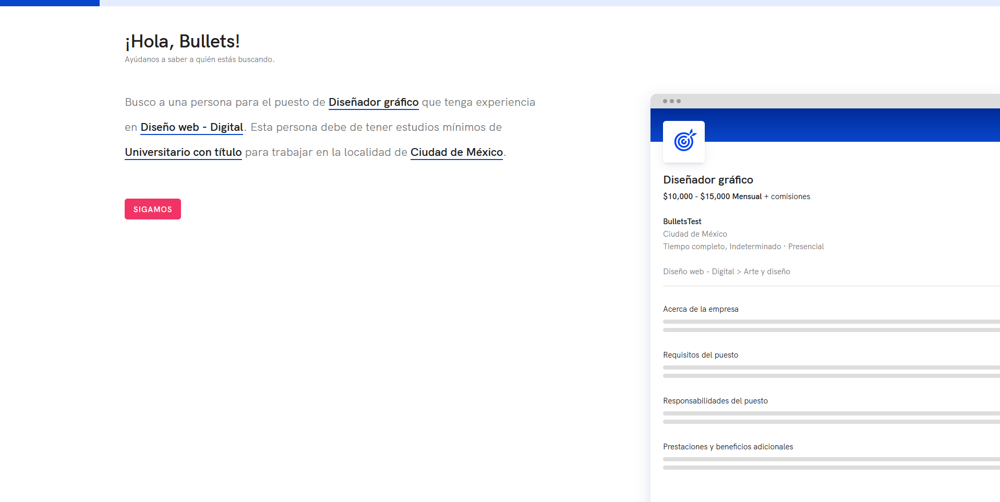
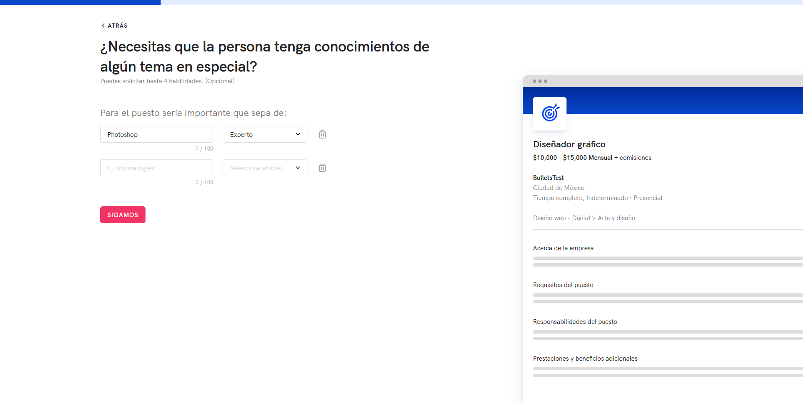
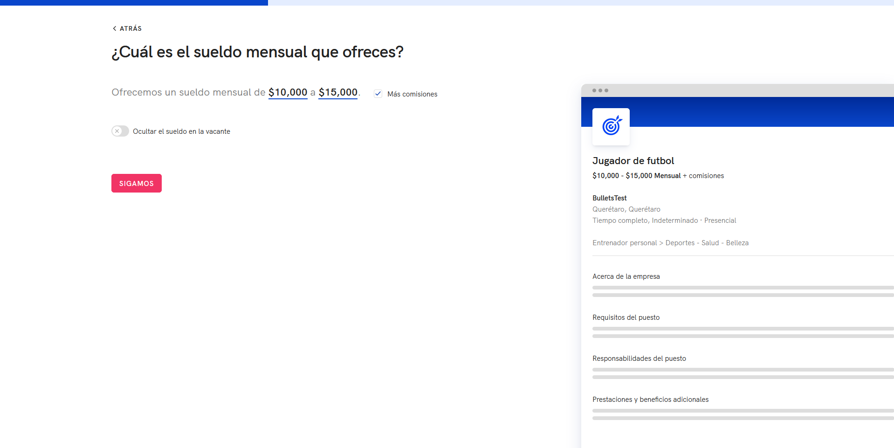
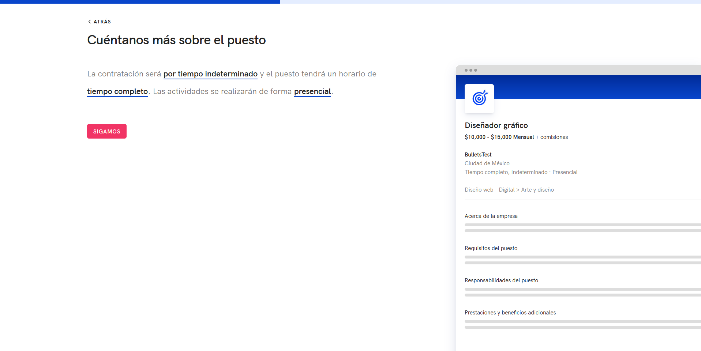
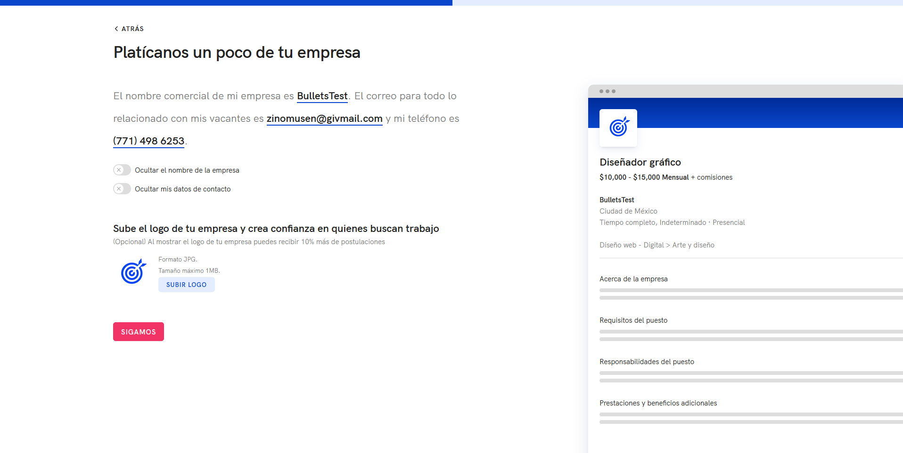
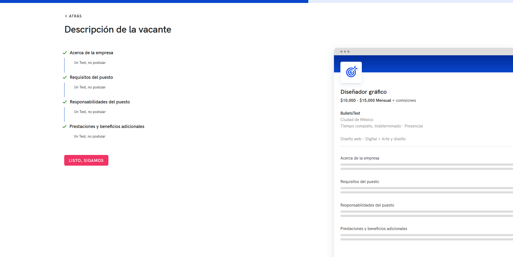
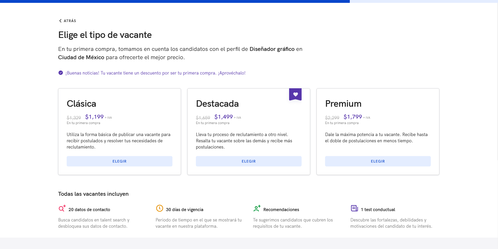
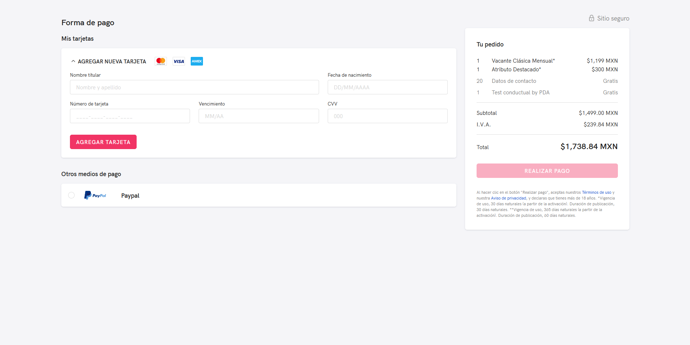

# Creación de cuenta y primera publicación de vacante.

**Repositorio:** <https://github.com/occmundial/recruiter-selfService>

**Requisitos previos:**

* [Node 10.x en adelante](<https://nodejs.org/docs/latest-v10.x/api/>)

**Ambientes:**

* Local: <http://localhost:3051/empresas/publica-tu-vacante/a-quien-buscas> con dependencia de backend-login: <https://github.com/occmundial/backend-login>
* Desarrollo: <https://master.occdev.com.mx/empresas/publica-tu-vacante/a-quien-buscas>
* Producción: <https://www.occ.com.mx/empresas/publica-tu-vacante/a-quien-buscas>

**Principales Tecnologías:**

* [NextJS 12.1.4](<https://github.com/vercel/next.js/releases/tag/v12.1.4>)
* [Apollo 2.33.4](<https://github.com/apollographql/apollo-tooling/releases/tag/apollo%402.33.4>)
* [Graphql 15.5.1](<https://github.com/graphql/graphql-js/releases/tag/v15.5.1>)
* [React 17.0.2](<https://github.com/facebook/react/releases/tag/v17.0.2>)
* [Typescript 4.3.5](<https://github.com/microsoft/TypeScript/releases/tag/v4.3.5>)
* [Jest 26.6.1](<https://github.com/facebook/jest/releases/tag/v27.0.6>)

**Secciones:**

* A quien buscas /publica-tu-vacante/a-quien-buscas 
* Conocimientos /publica-tu-vacante/conocimientos 
* Sueldo /publica-tu-vacante/sueldo 
* Puesto /publica-tu-vacante/puesto 
* Tu Empresa /publica-tu-vacante/tu-empresa 
* Describe el puesto /publica-tu-vacante/describe-el-puesto 
* Vacante /publica-tu-vacante/vacante 
* Pago /publica-tu-vacante/pago 
* Publicar /publica-tu-vacante/publicar 

**Reglas de negocio:**
* Son usuarios nuevos que quieren publicar solo UNA vacante, por lo tanto deben crear una 
cuenta de usuario de OCC la cual tendrá privilegios de administrador hacía la organización.
* El usuario tendrá que terminar el flujo para poder acceder a la plataforma.
* Las vacantes clásicas creadas y publicadas en este flujo se publican por default con razón social
a excepción que el usuario elija no mostrar nombre de la empresa.
* Las vacantes creadas y publicadas en este flujo de tipo destacada y premium se publican por 
default con nombre comercial a excepción que el usuario elija no mostrar nombre de la empresa.
* En la pantalla donde el usuario abandone el flujo, al volver deberá ser direccionado a la misma 
pantalla donde se quedó.
* En el checkout de FJA solo existe la posibilidad de pagar con tarjeta de crédito o débito y/o 
paypal.
* El correo utilizado en creación de cuenta puede ser igual o diferente en la pantalla datos de 
contacto.
* Precios variables solo está disponible en el flujo de FJA.

**Servicios utilizados:**
```json
{
    "unleash": {
        "production": "http://unleash.occlabs.xyz/api/",
        "development": "http://52.32.198.162:4242/api/",
        "description:": "Tráfico porcentual de acceso."
    },
    "roles": {
        "production": "https://rolespredsvc.occtech.io/roles?text=''&sort=''&count=''",
        "development": "https://rolespredsvc.occtech.io/roles?text=''&sort=''&count=''",
        "description:": "Obtener sugerencias para el rol del puesto de la vacante."
    },
    "skills": {
        "production": "http://skills-service.occtech.io/skills?text=''",
        "development": "http://skills-service.occtech.io/skills?text=''",
        "description:": "Obtener sugerencias para la habilidad proporcionada para la vacante."
    },
    "categories": {
        "production": "http://catpredsvc.occtech.io/categories?jobtitle=''&sort=''&count=''",
        "development": "http://catpredsvc.occtech.io/categories?jobtitle=''&sort=''&count=''",
        "description:": "Obtener sugerencias para la categoría del puesto dependiendo el rol proporcionado."
    },
    "lkp": {
        "production": "http://lookup.svc.occ/lookup/v1_0/category/",
        "development": "http://10.10.30.92:4046/lookup/v1_0/category/",
        "description:": "Devuelve un catálogo de todas las categorías o subcategorías para la vacante."
    },
    "insights": {
        "production": "http://companies.svc.occ/insights/v1_0/stats/?fn=''&placeid=''&categoryId=''&salarymin=&salarymax=&active=1&omit_salarywithzeros=1",
        "development": "http://10.10.30.85:8080/insights/v1_0/stats/?fn=''&placeid=''&categoryId=''&salarymin=&salarymax=&active=1&omit_salarywithzeros=1",
        "description:": "Obtener un sueldo promedio dependiendo la localidad y categoría de la vacante."
    },
    "assLogo": {
        "production": "http://assgo.prod.svc.occ/ass/v3_0/logo",
        "development": "http://assgo.svc.dev.occ/ass/v3_0/logo",
        "description:": "Utilizado para cargar logotipo en datos de la empresa."
    },
    "validateRfc": {
        "production": "http://api-veridoc-rfc.prod.svc.occ/veridoc/rfc?recruiterType=Administrador&accountType=OCC&origin=FJA",
        "development": "http://api-veridoc-rfc.svc.dev.occ/veridoc/rfc?recruiterType=Administrador&accountType=OCC&origin=FJA",
        "description:": "Verificar el tipo de RFC proporcionado para los datos de facturación."
    },
    "products": {
        "production": "https://s3-us-west-2.amazonaws.com/recruiters-ecosystem-stuff/product.json",
        "development": "https://s3-us-west-2.amazonaws.com/recruiters-ecosystem-stuff-staging/product.json",
        "description:": "Obtener un listado con todos los precios del tipo de vacante seleccionado."
    },
    "tlaloc": {
        "production": "http://tlaloc.svc.occ/tlaloc/sepomex?postalCode=''",
        "development": "http://tlaloc.svc.dev.occ/tlaloc/sepomex?postalCode=''",
        "description:": "Validación del código postal ingresado en datos de facturación de la empresa."
    },
    "suggestTlaloc": {
        "production": "http://tlaloc.svc.occ/tlaloc/sepomex/suggests/'cp'?compatibility=locations",
        "development": "http://10.10.30.84:5010/tlaloc/sepomex/suggests/'cp'?compatibility=locations",
        "description:": "Obtener listado de localidades dependiendo el código postal."
    },
    "variablePricing":{
        "production": "http://api-variable-pricing.prod.svc.occ/api-variable-pricing/variable-price",
        "development": "http://api-variable-pricing.svc.dev.occ/api-variable-pricing/variable-price/dummy",
        "description:": "Url del servicio de Variable Pricing."
    },
    "localFeatures": {
        "production": "https://www.occ.com.mx/empresas/publica-tu-vacante/api/featureToggles",
        "development": "https://master.occdev.com.mx/empresas/publica-tu-vacante/api/featureToggles",
        "description:": "Consulta de los toggles en la aplicación."
    },
    "localVariablePricing": {
        "production": "https://www.occ.com.mx/empresas/publica-tu-vacante/api/variablePricing",
        "development": "https://master.occdev.com.mx/empresas/publica-tu-vacante/api/variablePricing",
        "description:": "Petición de Variable Pricing en API interna."
    },
    "genesis": {
        "production": "http://genesis.prod.svc.occ/flow/first-job",
        "development": "http://genesis.svc.dev.occ/flow/first-job",
        "description:": "Genesis nos ayuda a almacenar todos los datos que ingresamos en FJA, también se encarga de consultar y eliminar esos datos."
    },
    "createCard": {
        "production":"https://api.openpay.mx/v1/:merchantID/cards",
        "development": "https://sandbox-api.openpay.mx/v1/:merchantID/cards",
        "description": "Agregar una nueva tarjeta."
    },
    "boards": {
        "production": "http://rcs-jobs.svc.occ/rcs/v3/accounts/'userId'/jobs/'jobId'/boards?token=''",
        "development": "http://rcs-jobs.svc.dev.occ/rcs/v3/accounts/'userId'/jobs/'jobId'/boards?token=''",
        "description": "Publica la vacante en boards(tableros)."
    },
    "rcsJobsSkills": {
        "production": "http://rcs-jobs.svc.occ/rcs/v3/jobs/'jobId'/skills?token=''",
        "development": "http://rcs-jobs.svc.dev.occ/rcs/'userId'/jobs/'jobId'/boards?token=''",
        "description": "Guarda un skill para la vacante."
    },
    "publish": {
        "production": "http://acl-argos-rcs.prod.svc.occ/rcs/v1_0/job/'jobId'?token=''&origin=FJA&operationtype=''",
        "development": "http://acl-argos-rcs.svc.dev.occ/rcs/v1_0/job/'jobId'?token=''&origin=FJA&operationtype=''",
        "description": "Se encarga de publicar la vacante."
    },
    "atreel": {
        "production": "http://atreel.svc.occ/a3ls/v1_0/smtps",
        "description": "Envía un correo solicitando la revisión de la vacante, contiene términos discriminatorios."
    },
    "addCart": {
        "production": "http://ecom.svc.occ/ecom/v1_0/cart/item/?productid=''&quantity=''&token=''",
        "development": "http://ecom.svc.dev.occ/ecom/v1_0/cart/item/?productid=''&quantity=''&token=''",
        "description": "Se encarga de crear el carrito."
    },
    "cart": {
        "production": "http://ecom.svc.occ/ecom/v1_0/cart/?token=''",
        "development": "http://ecom.svc.dev.occ/ecom/v1_0/cart/?token=''",
        "description": "Obtener la información del carrito."
    },
    "organization": {
        "production": "http://xapi-argos-orgs.prod.svc.occ/organizations/graphql",
        "development": "http://xapi-argos-orgs.svc.dev.occ/organizations/graphql",
        "description": "Crea la organización con los datos de facturación."
    },
    "rcsJob": {
        "production": "http://acl-argos-rcs.prod.svc.occ/rcs/v1_1/job/?token=''&origin=FJA",
        "development": "http://acl-argos-rcs.svc.dev.occ/rcs/v1_1/job/?token=''&origin=FJA",
        "description": "Creación de vacante."
    },
    "refresh": {
        "production": "https://scrappy.occ.com.mx/api/create",
        "development": "https://backendlogin.occdev.com.mx/api/create",
        "description": "Actualizar token de sesión."
    },
    "statements": {
        "production": "http://acl-argos-rcs.prod.svc.occ/rcs/v1_0/statement/allservicegroup?token=''&statementtype=statement",
        "development": "http://acl-argos-rcs.svc.dev.occ/rcs/v1_0/statement/allservicegroup?token=''&statementtype=statement",
        "description": "Obtener los créditos."
    },
    "rcsCompanies": {
        "production": "http://rcs-account-jwt.svc.occ/rcs/v3/companies/?companyname=''&rfc=null&email=''",
        "development": "http://rcs-account-jwt.svc.dev.occ/rcs/v3/companies/?companyname=''&rfc=null&email=''",
        "description": "Obtener la información de empresa."
    },
    "saveJobs": {
        "production": "http://jobs-admin.svc.occ/rcs/v3/accounts/'userId'/jobs_admin?token=''&status=all",
        "development": "http://rcs-jobs-admin.svc.dev.occ/rcs/v3/accounts/'userId'/jobs_admin?token=''&status=all",
        "description": "Obtener vacantes."
    },
}
```